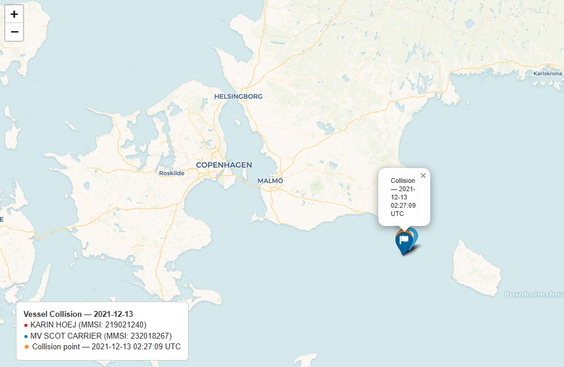
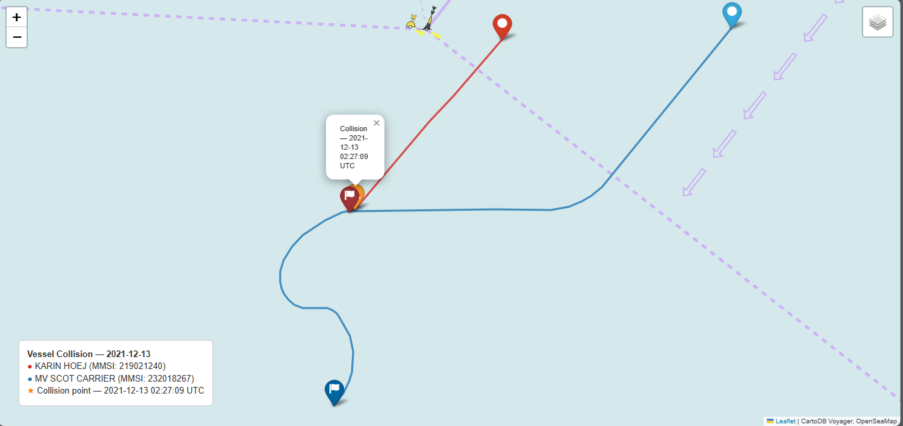

# AIS Vessel Collision Detection

A PySpark-based pipeline for detecting vessel collisions in AIS (Automatic Identification System) data that identifies the closest physical proximity event indicative of a collision within a 50-nautical-mile radius of the Bornholmsgat Traffic Separation Scheme, Baltic Sea, December 2021.

## Result

```
Total collisions detected: 1

------------------------------------------------------------
COLLISION 1 OF 1
============================================================
Vessel A:        KARIN HOEJ (MMSI: 219021240)
Vessel B:        MV SCOT CARRIER (MMSI: 232018267)
Timestamp:       2021-12-13 02:27:09 UTC
Location:        55.223260°N, 14.244362°E
Distance:        65.1 meters
DCPA:            14.9 meters
TCPA:            0.2 minutes
SOG A:           6.1 knots
SOG B:           11.8 knots
Ship Type A:     Other
Ship Type B:     Cargo
COLREG Scenario: Crossing (Rule 15) -> relative bearing 251.1°
------------------------------------------------------------
```
See [REPORT.md](REPORT.md) for full methodology, verification steps and analysis.

## Visual verification

Geographic context: Bornholm and Bornholmsgat TSS lanes


Vessel trajectories ±10 minutes around collision


An interactive HTML map is saved to `./output/` when the container runs.

## Requirements

- Docker Desktop
- AIS data: `aisdk-2021-12-*.csv` or `aisdk-2021-12.zip` (Danish AIS, [http://aisdata.ais.dk](http://aisdata.ais.dk))
- At least 10GB RAM allocated to Docker (WSL2 users: see note below)
- At least 2GB free disk space for the Docker image
- Additional space for AIS data: ~1.9GB per day CSV, ~50GB for full month

## Quick Start

**1. Clone the repository**
```bash
git clone https://github.com/katarinako01/AIS_collision_detection.git
cd AIS_collision_detection
```

**2. Place data**

Place either extracted CSV files or the zip archive in the `./data/` directory:
```
data/
└── aisdk-2021-12-13.csv   # single day, or
└── aisdk-2021-12.zip      # full month (auto-extracted on run)
```

**3. Build the image**
```bash
docker-compose build
```

**4. Run the pipeline**
```bash
docker-compose up
```

**5. Check the output**

The collision map is saved to `./output/collision_map_219021240_232018267.html` (note: title contains MMSIs of both vessels). Open it in any browser.

## Docker Hub

The pre-built image is available on Docker Hub:

```bash
docker pull katarinako01/ais-collision:v1.0
```

To run directly without building:
```bash
docker run --rm \
  -v ./data:/data \
  -v ./output:/app/output \
  katarinako01/ais-collision:v1.0
```

## WSL2 Memory configuration

Docker on Windows uses WSL2. By default, WSL2 may not allocate enough memory for Spark. To configure:

Create or edit `C:\Users\<username>\.wslconfig`:
```
[wsl2]
memory=12GB
processors=4
swap=4GB
```

Then restart WSL:
```powershell
wsl --shutdown
```

Restart Docker Desktop and run again.

## Project Structure

```
AIS_collision_detection/
├── data/               # place CSV or ZIP here
├── output/             # collision map will be saved here
├── images/             # report visuals (screenshots of the generated folium map)
├── src/
│   └── main.py         # full PySpark pipeline
├── Dockerfile
├── docker-compose.yml
├── requirements.txt
├── README.md
└── REPORT.md
```

## Environment

| Component | Version |
|---|---|
| Python | 3.13 |
| PySpark | 4.0.2 |
| Java | 21 |
| H3 | 4.5.0 |
| Folium | 0.20.0 |

## References

- Martelli, M., Žuškin, S., Cellerino, E., & Zaccone, R. (2024). Ship collision detection and classification employing AIS data. Paper presented at The 34th International Ocean and Polar Engineering Conference, Rhodes, Greece, June 2024. [ResearchGate](https://www.researchgate.net/publication/384980458_Ship_Collision_detection_and_classification_employing_AIS_data)
- Liu, Z., Zhang, B., Zhang, M., Wang, H., & Fu, X. (2023). A quantitative method for the analysis of ship collision risk using AIS data. *Ocean Engineering*, 272, 113906. [https://doi.org/10.1016/j.oceaneng.2023.113906](https://doi.org/10.1016/j.oceaneng.2023.113906)
- ITU-R M.585-9 (2019). Assignment and use of identities in the maritime mobile service. https://www.itu.int/rec/R-REC-M.585/en
- COLREG (1972). Convention on the International Regulations for Preventing Collisions at Sea. [https://www.imo.org/en/about/conventions/pages/colreg.aspx](https://www.imo.org/en/about/conventions/pages/colreg.aspx)
